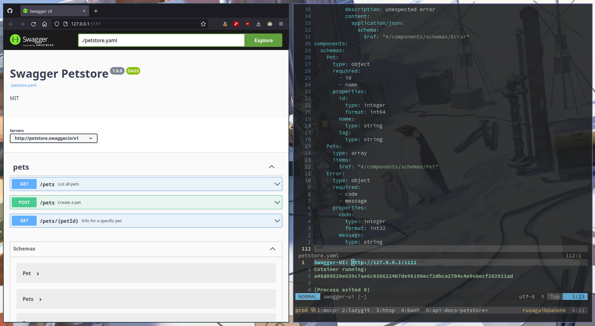

# oas-preview.nvim
WIP a simple nvim plugin to preview oas/openapis3 or swagger spec, now includes multiple wrapper container-ui to choose for your preference like swagger, redocly/redoc and stoplight 



### Prerequisite :sparkles:
---
#### Installing the UI:

**swagger-ui (docker):**

```sh
docker pull swaggerapi/swagger-ui:latest
```
**redoc-ui (docker):**

```sh
docker pull redocly/redoc
```

**stoplight-ui (unofficial docker):**

```sh
docker pull skriptfabrik/elements-cli
```

### Install Plugin :rocket:
---

**Lazy.nvim:** *recomended* :hugs:

Default:

```
{
    'rusagaib/oas-preview.nvim',
},
```

basic config with auto-setup  :sparkles:

```
{
    'rusagaib/oas-preview.nvim',
    config = function()
        require('oas-preview').setup({
            port = "1111",  -- up-to-you 
            ui = "swagger",  -- "swagger", "redoc", "stoplight"
            auto_open_url = false -- false to disable it, default is true
            expose = false -- false to disable from exposing your container-ui, default is false so don't worry man
        })  
    end,
},
```

**Packer:**

add this line on your packer config.lua just add rusagaib/oas-preview.nvim

```
use {'rusagaib/oas-preview.nvim'}
```

**Plug:**

add this line on your config

```
Plug 'rusagaib/oas-preview.nvim'
```


### Apply/setup oas-preview plugin :bow:
---

if you're not using Lazy.nvim as plugin manager this section is needed..

In your init.lua (Default nvim config):

```
# with Default config you'll get this conf 
# api_route = "http://127.0.0.1",
# port = "1111", 
# ui = "swagger", 
# auto_open_url = true, 
# expose = false
require('oas-preview').setup({})
```

~ OR ~

```
# choose your preferences ui, disable auto_open_url, disable expose host container-ui etc..
require('oas-preview').setup({
    port="2222", -- or any port you want 
    ui="stoplight", -- option ui: swagger, redoc, stoplight 
    auto_open_url=false, -- you can choose true or false
    expose=false -- default is false tho, but if you need to expose it for local network test or else you can set it to true
})
```

### Run :fire:
---


```
:OASPreview
```


### Stop opts :triangular_flag_on_post:
---

will stop buffer commands & delete container-ui

```
:OASPreviewStop
```


### Check Config :gear: 
---

will print out your set config on oas-preview  

```
:OASPreviewConf
```

### Check Runing Service container-ui :package: 
---

will print out your container-ui info 

```
:OASPreviewCheck
```

---

#### Any contributions are welcome :beer:

